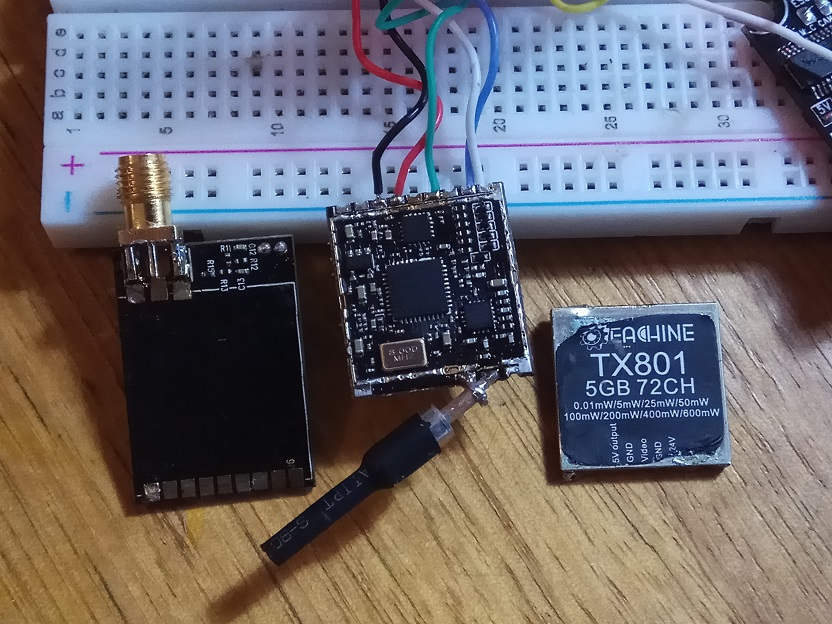
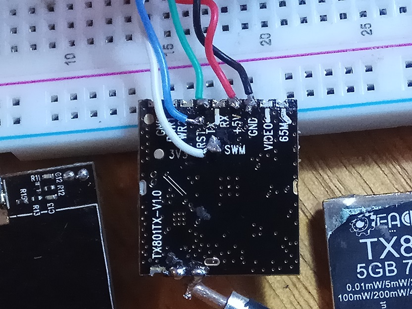
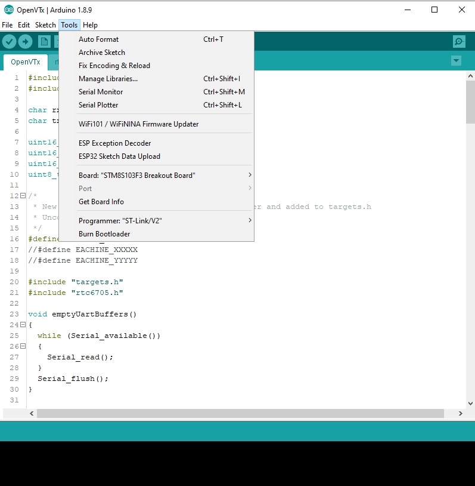

# OpenVTx
Open source video transmitter firmware for FPV

Working
- Implements the Tramp protocol
- Change frequency
- Change power. Power settings depends on the VTx and how the settings have been configured in target.h
- Remembers previous settings on reboot.

Attempts to do but needs checking and more work
- Clean startup and channel change.

Work in progress
- Pitmode

# Supported VTx
- Eachine TX801

# Setup
OpenVTx uses https://github.com/tenbaht/sduino. Follow its install instructions for the Arduino IDE.

# Flashing the VTx
Flashing requires an ST-LINK V2.  Connect is via the below images.

