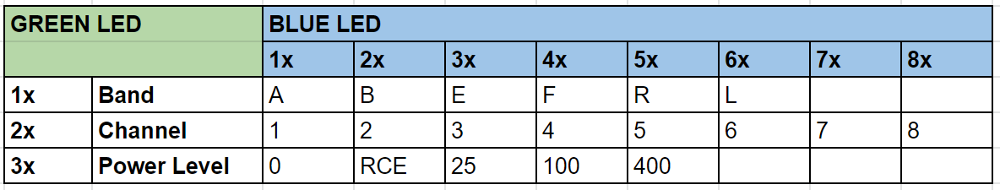
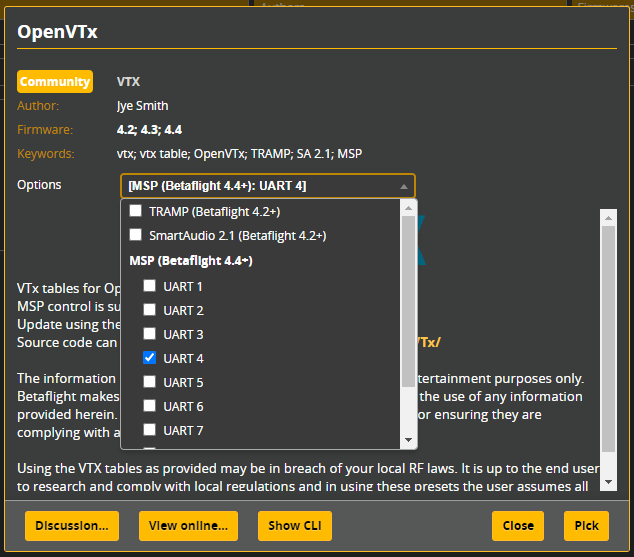

Join us on discord https://discord.gg/uGUKaD2u8Z

# Open source video transmitter firmware for the FPV community

OpenVTx aims to provide firmware with MSP, SmartAudio and Tramp protocols.  Any protocol can be used on the flight controller and on VTx power up the protocol used is automatically detected by OpenVTx.

From OpenVTx 0.2 and Betaflight 4.4 MSP will be the preferred protocol to use.

Currently SA is fully implemented and test against [Rev. 09](https://www.team-blacksheep.com/tbs_smartaudio_rev09.pdf).  To date IMRC has not released a protocol standard and implementation is based on information found within Betaflight.

# Features

**MSP Control** - MSP is the most common and vender neutral communication protocol.  Like SmartAudio and TRAMP it can be used to set the VTx frequency, power, and pitmode.  It has the added benefit of being able to self configure the VTx Table used in Betaflight.  When the VTx powers up it will query the flight controller and check for a VTx Table.  If it does not exist, or is incorrect, then OpenVTx will send the correct VTx Table to the flight controller.

**Race Mode** - When at a race event and using pitmode on a switch with Betaflight, select the RCE VTx power level.  It will force pitmode on boot and only use 25mW.

# LEDs

### Normal mode

The ```Red``` LED will power on at boot and twinkle when saving changes.  ```Green``` and ```Blue``` indicate current operating mode (band/channel/power) when using MSP, SmartAudio, or the VTx Button.  Not supported with TRAMP due to TRAMP not having a fixed VTx Table.

The VTX mode LED indication logic:



When using TRAMP or ``LED_INDICATION_OF_VTX_MODE=0``, ```Red``` LED will power on at boot and twinkle when saving changes.  ```Green``` will turn on when a protocol has been detected e.g. successful communication via TRAMP with the flight controller.  ```Blue``` will blink every time a communication packet is received.

### Error Mode

If OpenVTx detects an error the ```Red``` LED will flash one of the error codes below.

- RTC6705 not detected - 1s on to indicate start of the error code, followed by 3 quick flashes.

# Betaflight Setup

From Betaflight 4.4 MSP will be the preferred protocol to use.  Connect the single VTx telemetry wire as normal to a FC uart Tx pad.  Then select that uart from the OpenVTx Preset.  There is no need to configure the Ports tab for the VTx, as the Preset will handle the Port setup for you.  On power up the VTx will then check and configure the VTx Table.

If using SmartAudio or TRAMP, setup the Ports tab as normal, then pick the SmartAudio/TRAMP option from the OpenVTx Preset.



# Currently Supported VTx

OpenVTx is continually adding support for more hardware.  The most up to date list will be found in the ```platformio.ini``` file. https://github.com/OpenVTx/OpenVTx/blob/master/src/platformio.ini

# DIY Setup and flashing the EWRF E7082VM

fubarphill has made a fairly thorough video explaining the project and flashing process on youtube.  Please take the time to watch it.  Flashing requires an [ST-LINK V2](https://www.aliexpress.com/wholesale?catId=0&initiative_id=SB_20210125211035&SearchText=ST-LINK+V2) and connection is via the below image.

[EWRF E7082VM V1 & V2](https://www.aliexpress.com/wholesale?catId=0&initiative_id=SB_20210125211126&SearchText=EWRF+E7082VM) - Max output power of [+500mW](img/EWRF_E7082VM_500mW.jpg).

OpenVTx uses VS Code and [PlatformIO](https://platformio.org/platformio-ide).


[](https://www.youtube.com/watch?v=JsJOMwu4hBM) 

# Contributors

Big thanks to cruwaller for adding the GD32 MCU found on the EWRF E7082VM, [and everyone else!](https://github.com/OpenVTx/OpenVTx/graphs/contributors)
