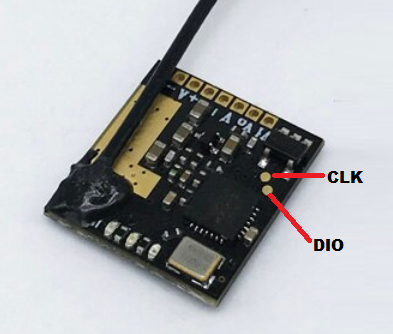

**Open source video transmitter firmware for the FPV community**

OpenVTx aims to provide firmware with both the SmartAudio and Tramp protocols.  Either protocol can be used on the flight controller and on VTx power up the protocol used is automatically detected by OpenVTx.

Currently SA is fully implemented and test against [Rev. 09](https://www.team-blacksheep.com/tbs_smartaudio_rev09.pdf).  To date IMRC has not released a protocol standard and implementation is based on information found within Betaflight.

# Currently Supported VTx
- [EWRF E7082VM V1 & V2](https://www.aliexpress.com/wholesale?catId=0&initiative_id=SB_20210125211126&SearchText=EWRF+E7082VM) - Max output power of [+500mW](img/EWRF_E7082VM_500mW.jpg).

# Setup
OpenVTx uses VS Code and [PlatformIO](https://platformio.org/platformio-ide).

# Flashing the VTx
Flashing requires an [ST-LINK V2](https://www.aliexpress.com/wholesale?catId=0&initiative_id=SB_20210125211035&SearchText=ST-LINK+V2) and connection is via the below image.  Shown below is of the E7082VM and other targets will differ in appearance but the process will be similar.  Details will be added to a wiki as more targets are added.  Select your VTx target from within PlatformIO and press Upload.



# Betaflight VTx Tables

Copy and paste your choice of protocol [VTx table](https://github.com/betaflight/betaflight/wiki/VTX-tables) into the Betaflights CLI.

```
# SMARTAUDIO
# vtxtable
vtxtable bands 5
vtxtable channels 8
vtxtable band 1 BOSCAM_A A FACTORY 5865 5845 5825 5805 5785 5765 5745 5725
vtxtable band 2 BOSCAM_B B FACTORY 5733 5752 5771 5790 5809 5828 5847 5866
vtxtable band 3 BOSCAM_E E FACTORY 5705 5685 5665 5645 5885 5905 5925 5945
vtxtable band 4 FATSHARK F FACTORY 5740 5760 5780 5800 5820 5840 5860 5880
vtxtable band 5 RACEBAND R FACTORY 5658 5695 5732 5769 5806 5843 5880 5917
vtxtable powerlevels 5
vtxtable powervalues 1 14 17 20 26
vtxtable powerlabels 0 25 50 100 400
save
```
```
# TRAMP
# vtxtable
vtxtable bands 6
vtxtable channels 8
vtxtable band 1 BOSCAM_A A CUSTOM  5865 5845 5825 5805 5785 5765 5745 5725
vtxtable band 2 BOSCAM_B B CUSTOM  5733 5752 5771 5790 5809 5828 5847 5866
vtxtable band 3 BOSCAM_E E CUSTOM  5705 5685 5665 5645 5885 5905 5925 5945
vtxtable band 4 FATSHARK F CUSTOM  5740 5760 5780 5800 5820 5840 5860 5880
vtxtable band 5 RACEBAND R CUSTOM  5658 5695 5732 5769 5806 5843 5880 5917
vtxtable band 6 IMD6     I CUSTOM  5732 5765 5828 5840 5866 5740    0    0
vtxtable powerlevels 5
vtxtable powervalues 1 25 50 100 400
vtxtable powerlabels 0 25 50 100 400
save
```

# Contributors

Big thanks to cruwaller for adding the GD32 MCU found on the EWRF E7082VM.
