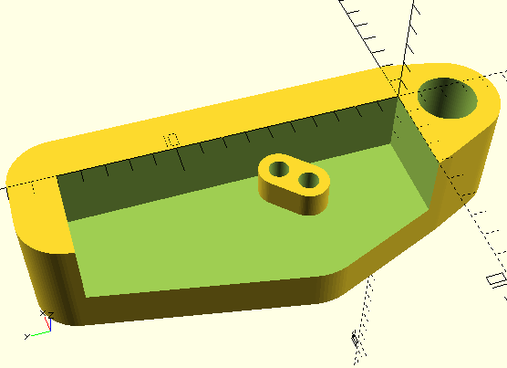
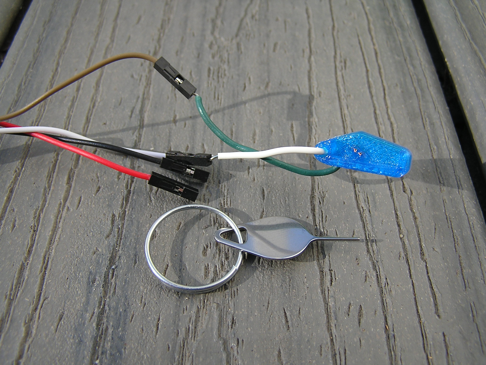
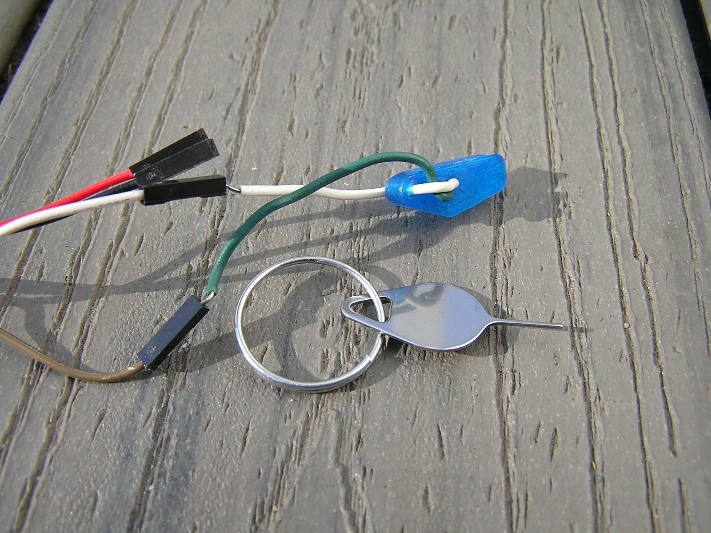

# EWRF E7082VM OpenVTX bootloader tool

### Please utilize this programming adapter at your own risk, report any issues you may find, and/or submit improvements.

This OpenSCAD design allows for OpenVTX bootloader programming onto the EWRF E7082VM board without needing to solder leads onto the CLK or DIO pads. You will still need to connect power and a common ground to the ST-LINK V2.  I have verified this print allowed me to flash OpenVTX bootloader to my VTX labeled 7082VM V12. I printed this in TPU/TPE and needed to re-poke holes for the wires with a sim card eject tool. I then ran some solid hook up wire as shown in images taking care that the wires do not short. In order to make good contact with the CLK and DIO pads I do recomend utilizing a sharp hobby knife to carefully shave the excess perferations from the side of the PCB until smooth.

